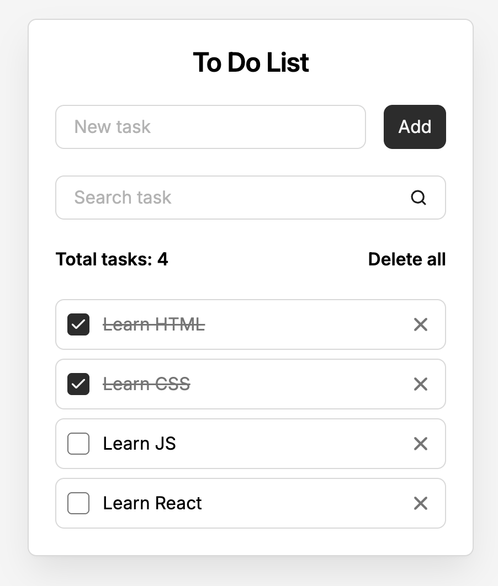

# 📝 To Do List на JavaScript

Простой "To Do List" на чистом **HTML**, **CSS** и **JavaScript**.

## 🔍 Описание проекта

- ✅ Добавление новой задачи (через отдельное поле)
- ✅ Поиск по текущим задачам (в реальном времени)
- ✅ Отметка задачи как выполненной
- ✅ Удаление одной задачи
- ✅ Удаление всех задач
- ✅ Счётчик количества задач
- ✅ Сохранение всех данных в `localStorage`
- ✅ Поддержка Enter-клавиши и автофокуса

## 📸 Превью

